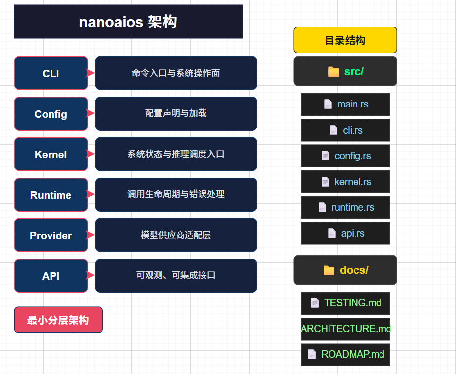

# nanoaios

有一阵子我一直在想：Agent 时代到来，我们到底该先造“应用集合”，还是先造“系统内核”,
[记录了当时的一些想法切片](https://lvyovo-wiki.tech/blog/memo-claw)，也是 `nanoaios` 的起点

`nanoaios` ：一个面向 Agent 时代的极简 AIOS-kernel demo实现，定位为 **AIOS 的 Linux**。  

目标不是堆叠“AI 功能集合”，而是提供一套可验证、可扩展、可替换的系统级 AI 抽象。


~~写燃起来了，快速 vibe 的一个项目~~，之后或许会继续完善，欢迎交流讨论


---

## 项目定位

<p align="center"></p>

在 `nanoaios` 中，AI 不是外挂能力，而是系统原生能力：

- 用最小内核面承载推理入口与系统状态
- 用运行时抽象屏蔽模型供应商差异
- 用统一 API 暴露可观测与可集成能力

核心原则：

- **简洁优先**：单仓库、单二进制、低复杂度
- **边界清晰**：Kernel / Runtime / Provider 分层明确
- **工程可落地**：可启动、可测试、可演进

---

## 当前能力（v0.1）

- `nanoaios init`：初始化 `~/.nanoaios/config.toml`
- `nanoaios start`：启动内核 API
- `nanoaios chat "<prompt>"`：单轮推理调用
- `nanoaios config`：打印当前配置
- Provider 抽象：
  - `mock`（离线调试）
  - `openai_compatible`（OpenAI 兼容接口）

已提供 API：

- `GET /healthz`
- `GET /v1/kernel/state`

---

## 快速开始

### 1) 初始化

```bash
cd nanoaios
cargo run -- init
```

### 2) 启动服务

```bash
cargo run -- start
```

### 3) 验证服务

```bash
curl -s http://127.0.0.1:4242/
curl -s http://127.0.0.1:4242/healthz
curl -s http://127.0.0.1:4242/v1/kernel/state
```

浏览器直接访问 `http://localhost:4242/` 也会返回服务入口信息（JSON）。

### 4) 对话测试

```bash
cargo run -- chat "你好，nanoaios"
```

---

## 架构概览

`nanoaios` 采用最小分层：

- **CLI**：命令入口与系统操作面
- **Config**：配置声明与加载
- **Kernel**：系统状态与推理调度入口
- **Runtime**：调用生命周期与错误处理
- **Provider**：模型供应商适配层
- **API**：可观测、可集成接口

目录结构：

```text
src/
  main.rs
  cli.rs
  config.rs
  kernel.rs
  runtime.rs
  api.rs
docs/
  TESTING.md
  ARCHITECTURE.md
  ROADMAP.md
```

---

## 开发与验证

```bash
# 代码格式检查
cargo fmt -- --check

# 严格静态检查
cargo clippy -- -D warnings

# 测试
cargo test

# 冒烟验证
cargo run -- init --force
cargo run -- chat "smoke test"
```

更完整步骤见 `docs/TESTING.md`。

---

## 路线图

短期目标（v0.2 / v0.3）：

- Session / Memory 子系统
- Tool 执行层（白名单、超时、审计）
- Agent manifest 与能力门控
- Daemon 化与服务管理

详见 `docs/ROADMAP.md`。

---

## 稳定性说明

当前版本处于早期阶段，接口和内部实现仍会迭代。  
建议在生产环境固定 commit 或版本后再部署。

---

## 贡献

欢迎提交 Issue / PR。建议在提交前执行：

```bash
cargo fmt -- --check
cargo clippy -- -D warnings
cargo test
```

详细贡献说明见 `CONTRIBUTING.md`。

---

## 许可协议

本项目采用 MIT License，详见 `LICENSE`。
